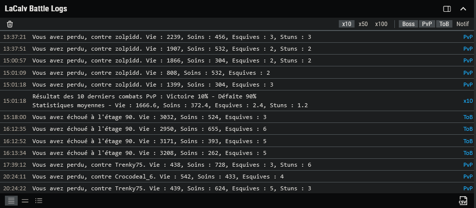
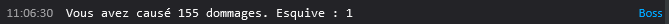
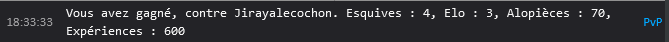
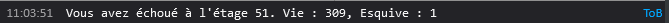
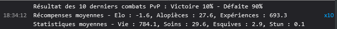
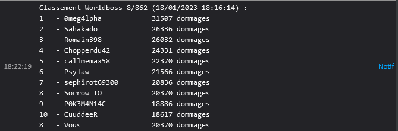
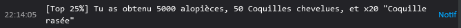
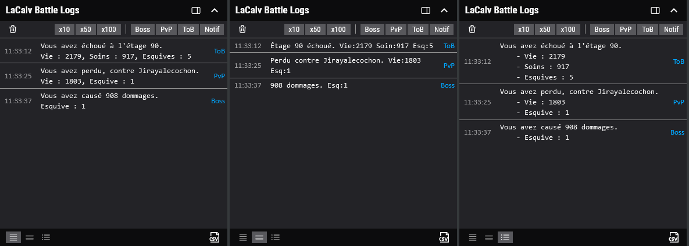
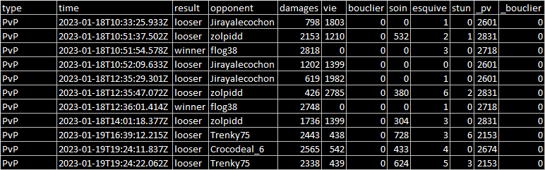
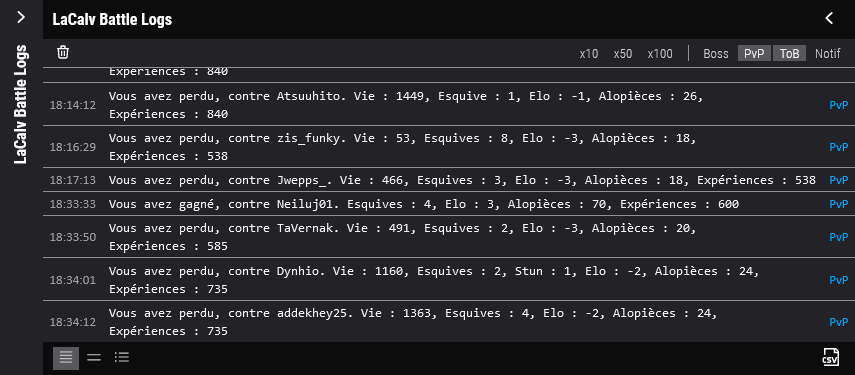

# LaCalv Battle Logs

Ce script est conçu pour être utilisé sur le site LaCalv (https://lacalv.fr/) et permet d'intercepter les réponses du
site web, de les formater et de les afficher dans une console dédiée. Il prend en charge l'export des données au format CSV. Pour utiliser ce script, il est recommandé
d'utiliser l'extension de navigateur Violentmonkey.

Violentmonkey est un add-on compatible avec un grand nombre de navigateurs tels que Firefox, Chrome, et Opera, qui
permet d'utiliser des scripts utilisateur (user script) pour personnaliser les sites web.

## Installation

Pour utiliser ce script, vous avez besoin d'une extension de navigateur compatible avec les scripts utilisateur, tels
que [Violentmonkey](https://violentmonkey.github.io/). Voici les liens pour installer Violentmonkey sur les navigateurs populaires :

- [Firefox](https://addons.mozilla.org/en-US/firefox/addon/violentmonkey/)
- [Google Chrome](https://chrome.google.com/webstore/detail/violentmonkey/jinjaccalgkegednnccohejagnlnfdag)
- [Opera](https://addons.opera.com/en/extensions/details/violent-monkey/)
- [Safari](https://safari-extensions.apple.com/details/?id=net.violentmonkey.Violentmonkey-1HV5)

Une fois que vous avez installé l'extension, cliquez sur le bouton "Ajouter ce script" ci-dessous pour installer le script sur votre navigateur.

## **LaCalv Battle Logs** ([lacalvbattlelogs.user.js](//github.com/sanjuant/LaCalvBattleLogs/blob/master/lacalvbattlelogs.user.js)) ([Ajouter ce script](//github.com/sanjuant/LaCalvBattleLogs/raw/master/lacalvbattlelogs.user.js))

## Installation sur téléphone ([Tuto PDF](//github.com/sanjuant/LaCalvBattleLogs/raw/master/tuto/Android_Installation_LaCalv_Battle_Logs.pdf))

Pour utiliser ce script sur votre téléphone, vous avez besoin d'installer le navigateur [Kiwi Browser](https://play.google.com/store/apps/details?id=com.kiwibrowser.browser).
Après avoir installé le navigateur, suivez la procédure précédente pour installer [Violentmonkey](https://violentmonkey.github.io/) comme si vous souhaitiez l'installer pour [Google Chrome](https://chrome.google.com/webstore/detail/violentmonkey/jinjaccalgkegednnccohejagnlnfdag).
Une fois que vous avez installé l'extension, cliquez sur le bouton "Ajouter ce script" ci-dessus pour installer le script sur votre navigateur.

Pour plus d'informations, référez-vous à la page [**Disponible sur téléphone avec Kiwi Browser** ](//github.com/sanjuant/LaCalvBattleLogs#disponible-sur-t%C3%A9l%C3%A9phone-avec-kiwi-browser).

## Fonctionnalités
1. [**Enregistrement des combats contre le Boss, des combats en PvP et des combats en ToB** ](//github.com/sanjuant/LaCalvBattleLogs#enregistrement-des-combats-contre-le-boss-des-combats-en-pvp-et-des-combats-en-tob)
2. [**Résumé des combats enregistrés tous les 10, 50 et 100 combats** ](//github.com/sanjuant/LaCalvBattleLogs#r%C3%A9sum%C3%A9-des-combats-enregistr%C3%A9s-tous-les-10-50-et-100-combats)
3. [**Filtres pour afficher uniquement les logs de combat de certains types (boss, PvP, ToB, etc.)** ](//github.com/sanjuant/LaCalvBattleLogs#filtres-pour-afficher-uniquement-les-logs-de-combat-de-certains-types-boss-pvp-tob-etc)
4. [**Bouton pour supprimer les messages indésirables** ](//github.com/sanjuant/LaCalvBattleLogs#bouton-pour-supprimer-les-messages-ind%C3%A9sirables)
5. [**Notification pour les points d'intérêts** ](//github.com/sanjuant/LaCalvBattleLogs#notification-pour-les-points-dint%C3%A9r%C3%AAts)
6. [**Changement du format des messages affichés** ](//github.com/sanjuant/LaCalvBattleLogs#changement-du-format-des-messages-affich%C3%A9s)
7. [**Export au format CSV** ](//github.com/sanjuant/LaCalvBattleLogs#export-au-format-csv)
8. [**Disponible sur téléphone avec Kiwi Browser** ](//github.com/sanjuant/LaCalvBattleLogs#disponible-sur-t%C3%A9l%C3%A9phone-avec-kiwi-browser)

### Enregistrement des combats contre le Boss, des combats en PvP et des combats en ToB

### Résumé des combats enregistrés tous les 10, 50 et 100 combats

### Filtres pour afficher uniquement les logs de combat de certains types (boss, PvP, ToB, etc.)

### Bouton pour supprimer les messages indésirables

Seuls les messages avec les filtres actifs seront supprimés.

### Notification pour les points d'intérêts

### Changement du format des messages affichés

Plusieurs formats d'affichages sont disponibles, normal, court et en liste.

### Export au format CSV

Seuls les messages avec les filtres actifs seront exportés.

### Disponible sur téléphone avec Kiwi Browser

Pour une meilleure comptabilité, veillez à créer une application du jeu LaCalv. Cliquer sur les trois points alignés puis sur "Ajouter à l'écran d'accueil".

